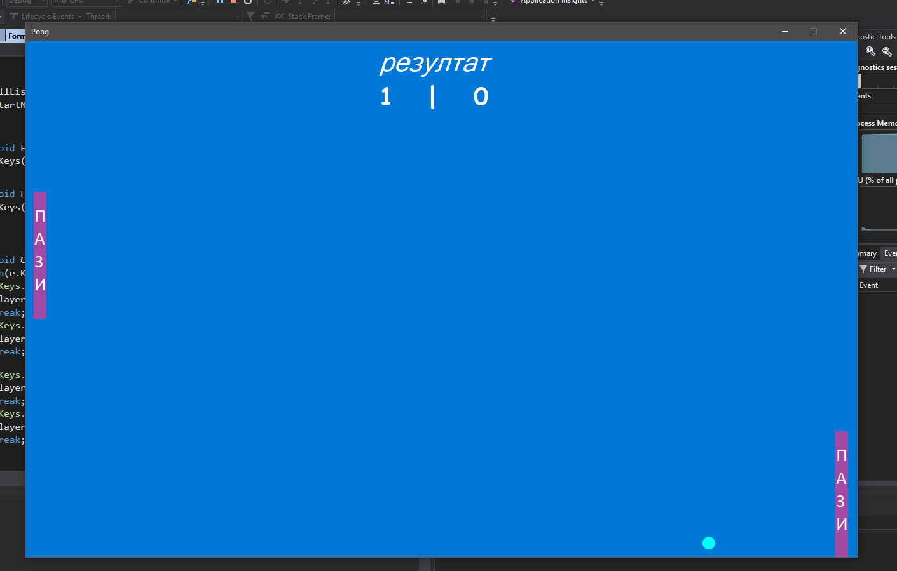
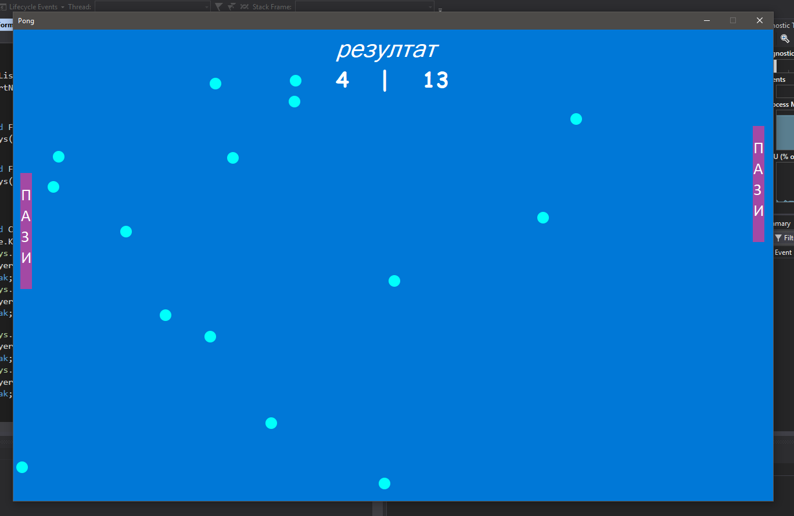
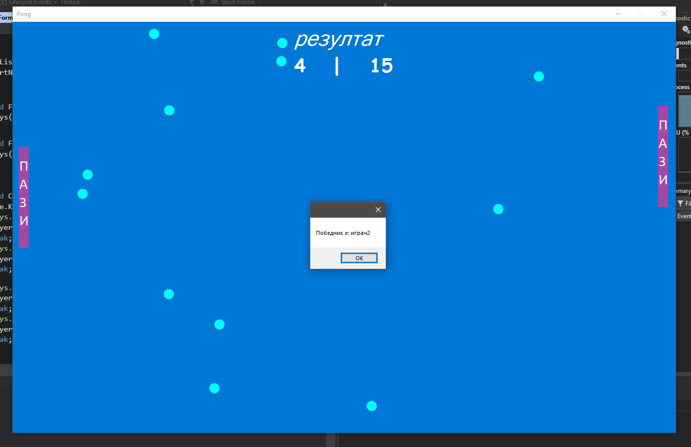

# Понг - Визуелно
###### Изработен од: *Јован Јакимовски (163088), Бојан Јакимовски (163142)*

## 1. Опис на Апликацијата:
Апликацијата која ја избравме е Понг видео играта која е една од првите аркадни видео игри, и претставува пинг-понг со 2D графика.

Нашата имплементација на играта e различна, така што ние додадовме со секој нов погодок да се појавува ново топче во играта.

## 2. Упатство за користење
Играта се игра од двајца играчи на иста тастатура

#### *Контроли*

```       
        Играч 1		  Играч 2
	Горе – W	  Горе – Стрелка нагоре
	Доле – S	  Доле – Стрелка надоле
```
Резултатот e видлив на екранот, играта завршува кога некој од играчите ќе стигне до 15 поени, тој тогаш е победник.
## 3. Решение
### 3.1 Дизајн и имплементација
Формата е со фиксна големина, и опциите за зголемување се исклучени за да нема неправилности во играта ако се зголеми работната површина
### 3.2 Класи
Имаме 3 класи:

`Player` класата го чува резултатот за играчот, палката како PictureBox, брзината и неколку помошни променливи.

#### Метод ProcessMove

Методот има за задача да утврди дали ќе одиме горе или доле, исто така случајот кога притискаме и нагоре и надоле е земен во предвид и тогаш вредноста на променливата се става на null и не се движиме.
```
            bool? goingUp = null;
            if(isUpPressed) {
                goingUp = true;
            }

            if(isDownPressed) {
                if(goingUp.HasValue) {
                    // Не се движиме
                    goingUp = null;
                } else {
                    goingUp = false;
                }
            }

            DoMove(goingUp);
```
Тука се пресметува и забрзувањето на палката, така што секој тик од саатот проверуваме дали е притиснато копче и дали е во иста насока како претходното ако е тогаш ќе го зголемуваме забрзувањето.

```
        //ако има претходно
            if(wasGoingUpLastTick.HasValue) {
              // не се движи - ресет на променливата
                if(!goingUp.HasValue) {
                    wasGoingUpLastTick = null;
                    numberOfTicksGoingInTheSameDirection = 0;
                }
              // иста насока - зголеми забрзување   
                else if(wasGoingUpLastTick.Value == goingUp.Value) {
                    numberOfTicksGoingInTheSameDirection++;
                }
              // нова насока - од почеток   
                else {
                    wasGoingUpLastTick = goingUp;
                    numberOfTicksGoingInTheSameDirection = 1;
                }
            }
            else if(goingUp.HasValue) {
                wasGoingUpLastTick = goingUp;
                numberOfTicksGoingInTheSameDirection = 1;
            }
```

#### Метод DoMove, ја пресметува новата брзина и новата локација на палката
```
private void DoMove(bool? goingUp) {
            if(goingUp.HasValue) {

            /* Новата брзина ја добиваме како математичка операција од брзината и од веќе пресметаното забрзување од претходно */

                var speed = (int)Math.Round(movementSpeed * ((float)numberOfTicksGoingInTheSameDirection / 10));

            //Ако се движиме нагоре брзината ја множи со -1

                if(goingUp.Value) {
                    speed *= -1;
                }

            }
        }
```

##### Новата локација, ограничување на палките, за да не се движат надвор од прозорецот.

Го ограничуваме така што ја споредува локацијата на долниот крај на формата : `PongWorldInfo.bottomOfWorld` , со новата локација : `paddle.Location.Y + speed` , и го бара минимумот од нив така што ако пробаме да одиме подоле нема да дозволи и ќе ја одбере крајната локација на формата : `PongWorldInfo.bottomOfWorld`, потоа ограничување од горната страна, треба да ја споредуваме најгорната позиција на формата : `PongWorldInfo.topOfWorld` чија вредност и 0, со новата позиција (која веќе е проверена и ограничена од доле) : `Math.Min(PongWorldInfo.bottomOfWorld - paddle.Height
, paddle.Location.Y + speed)`

```
            paddle.Location = new Point(paddle.Location.X,
                    Math.Max(PongWorldInfo.topOfWorld,
                        Math.Min(PongWorldInfo.bottomOfWorld - paddle.Height
                        , paddle.Location.Y + speed)
                        )
                    );
```

Во `Ball` класата се функционалностите за топчето како што е неговото движење.

*Во DoMove() го поместување топчето и приотоа се пази да не излезе од горе или доле (y-оска) на истиот начин објаснет од претходно*
```
    private int DoMove() {
         var bottom = PongWorldInfo.bottomOfWorld - ballPictureBox.Height;
         ballPictureBox.Location = new Point(ballPictureBox.Location.X + xSpeed,
             Math.Max(PongWorldInfo.topOfWorld, Math.Min(bottom, ballPictureBox.Location.Y + ySpeed))
             );
         return bottom;
     }
```
*Во ProcessMove() методот проверуваме дали настанале колизии со палките и*

*Доколку топчето стигне до крајот на формата по y-оската ја менуваме насоката*
```
    var bottom = PongWorldInfo.bottomOfWorld - ballPictureBox.Height;
    if(ballPictureBox.Location.Y >= bottom || ballPictureBox.Location.Y <= PongWorldInfo.topOfWorld) {
        ySpeed *= -1;
    }
```

*Доколку топчето не биде фатено и излезе од формата по х-оската топгаш го ажурираме резултатот соодветно и враќање true со што ќе знаеме дека треба да го избришеме топчето од листата*
```
            if(ballPictureBox.Location.X <= PongWorldInfo.leftOfWorld) {
                Score(leftsidePlayer);
                return true;
            } else if(ballPictureBox.Location.X >= PongWorldInfo.rightOfWorld - ballPictureBox.Width) {
                Score(rightsidePlayer);
                return true;
            }
```

*Ако топчето се судри со некоја од палките треба да ја смени насоката (оп х-оска) и да создадеме ново топче*
```
            if(leftsidePlayer.paddle.Bounds.IntersectsWith(ballPictureBox.Bounds)
            || rightsidePlayer.paddle.Bounds.IntersectsWith(ballPictureBox.Bounds)) {

              // Менува насока
                xSpeed *= -1;

              // Додаваме ново топче во листата од топчиња
              form.ballList.Add(new Ball(form, ballModel, leftsidePlayer, rightsidePlayer));

```

*И на крај го придвижуваме топчето се додека не се судира со палката*
```
                while(leftsidePlayer.paddle.Bounds.IntersectsWith(ballPictureBox.Bounds)
                    || rightsidePlayer.paddle.Bounds.IntersectsWith(ballPictureBox.Bounds)) {
                    DoMove();
                }
```

И последна е `Pong` класата која е главна класа за формата. Во нејзе ги чуваме двајцата играчи `Player player1, player2` и листа од топчиња `public List<Ball> ballList`. Од оваа класа се отповикуваат методоте во другите класи и се загарантирува целосна функционалност.

#### Timer_Tick()
*Ги стартуавме методите од Player класата*
          ` player1.ProcessMove();
            player2.ProcessMove();`

*Ги придвижуваме сите топчиња и тие што излегуваат ги бришеме од листата и во случај ако ги избришеме сите топчиња стартуваме нова игра тоест да додадеме ново топче*
```
            for(int i = ballList.Count - 1; i >= 0; i--) {

            // враќа true кога треба да се избрише топчето
                if(ballList[i].ProcessMove()) {
                    ballList.RemoveAt(i);
                }
            }

            // нема топчиња - додади ново топче
            if(ballList.Count == 0) {
                StartNewGame();
            }
```

*Последен е мотодот кој проверува дали копчето е притиснато или пуштено, како влезен аргумен внесуваме дали го притискаме или пуштаме додека он ги ажурира помошните променливи*
```
private void CheckKeys(KeyEventArgs e, bool isDown) {
      switch(e.KeyCode) {
        //Играч1
            case Keys.W:
                player1.isUpPressed = isDown;
                break;
            case Keys.S:
                player1.isDownPressed = isDown;
                break;

        //Играч2
            case Keys.Up:
                player2.isUpPressed = isDown;
                break;
            case Keys.Down:
                player2.isDownPressed = isDown;
                break;
      }
}
```

*Проверката за крај на играта ја правиме со следниот код :*
```
          if (player1.score == 15 || player2.score == 15)
            {
                var winner = (player1.score > player2.score) ? "играч 1" : "играч2";

                aTimer.Enabled = false;
                MessageBox.Show("Победник е: " + winner);
                this.Close();

            }
```

## Screenshots



